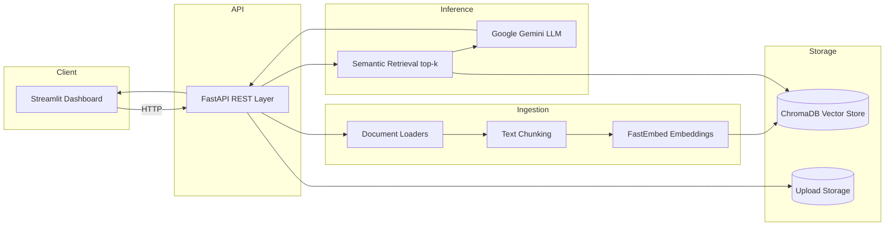

# Enterprise RAG Knowledge Assistant

A production-style **Retrieval-Augmented Generation (RAG)** application that ingests enterprise documents and generates **source-attributed responses from retrieved document context** through a conversational interface.

**Technology stack:** FastAPI, Streamlit, LangChain, ChromaDB, FastEmbed, Google Gemini, pytest, GitHub Actions

---

## Project Demo

[▶ Watch the demo](https://youtu.be/VZ_NKIzeFlc)

---

## Project Overview

This system implements an **enterprise knowledge assistant** that converts unstructured policy and handbook content into a searchable vector index. Users upload documents (PDF, TXT, DOCX), submit document-specific queries, and receive responses synthesized from semantically retrieved passages with **citation metadata** (source file and page, where applicable).

The solution separates concerns across a REST API layer, an ingestion/embedding pipeline, a vector store, and a lightweight web dashboard for document management and Q&A.

---

## Business Problem

Organizations store critical operational knowledge in distributed documents: HR handbooks, security policies, finance guidelines, and clinical/compliance manuals. Employees face:

- **Information fragmentation** across PDFs, Word files, and plain-text repositories
- **High lookup latency** when policies change or span multiple documents
- **Compliance risk** when answers are guessed instead of sourced from authoritative text
- **Poor scalability** of manual FAQ maintenance and helpdesk triage

This assistant addresses the gap by providing **on-demand semantic retrieval** over private document corpora, reducing time-to-answer while improving **traceability** through source-linked responses.

---

## Architecture



| Layer | Component | Responsibility |
|-------|-----------|----------------|
| Presentation | Streamlit (`frontend/`) | Upload UX, chat interface, source inspection |
| API | FastAPI (`app/main.py`) | Ingestion endpoints, query orchestration, health checks |
| Ingestion | LangChain loaders + splitter (`app/rag/ingest.py`) | Parse documents, chunk text, attach metadata |
| Embeddings | FastEmbed `BAAI/bge-small-en-v1.5` | Local dense vector encoding (no embedding API key) |
| Vector DB | ChromaDB | Persistent similarity search over document chunks |
| Generation | Google Gemini (`gemini-2.5-flash`) | Response synthesis from retrieved document context |

**Project structure**

```text
app/                 FastAPI backend and RAG pipeline
  main.py            REST endpoints
  rag/ingest.py      Document parsing and chunking
  rag/vectorstore.py Embedding and vector persistence
  rag/chain.py       Retrieval + LLM orchestration
frontend/            Streamlit dashboard
tests/               Unit and API integration tests
data/sample_docs/    Seed corpus for demos
.github/workflows/   CI pipeline
```

---

## Workflow

1. **Document ingestion** - User uploads PDF, TXT, or DOCX via dashboard or `POST /upload`.
2. **Parsing** - Loaders extract text; PDF page numbers are preserved in metadata.
3. **Chunking** - Recursive character splitting (800 characters, 120-character overlap) creates retrieval units.
4. **Embedding** - Chunks are encoded with FastEmbed and indexed in ChromaDB.
5. **Query** - User submits a document-specific query through the chat interface or `POST /ask`.
6. **Retrieval** - Top-k semantic search (`k=4`) fetches the most relevant chunks.
7. **Augmented generation** - Gemini synthesizes an answer using only retrieved context.
8. **Response delivery** - Answer and source excerpts are returned with file/page attribution.

If the LLM is unavailable, rate-limited, slow, or unconfigured, the system falls back to **retrieval-only mode** and surfaces ranked source passages (with page numbers when available) instead of returning an error.

---

## Dataset

The repository includes a **synthetic enterprise corpus** for demonstration and testing:

| Document | Domain | Content focus |
|----------|--------|---------------|
| `healthcare_handbook.txt` | Healthcare | Remote work, HIPAA, clinical policies |
| `hr_employee_handbook.txt` | Human Resources | PTO, benefits, workplace policies |
| `it_security_policy.txt` | Information Security | Passwords, VPN, data handling |
| `finance_expense_policy.txt` | Finance | Travel limits, reimbursement rules |

**Supported formats:** PDF, TXT, DOCX  
**Runtime storage:** Uploaded files are written to `data/uploads/`; the vector index is written to `data/chroma_db/`.

Users can extend the knowledge base with any domain-specific documents using the same ingestion pipeline.

---

## Running the Application

Use this procedure to run the application locally for development and demonstration.

**Prerequisites**

- Python 3.12
- pip
- A Google Gemini API key from [Google AI Studio](https://aistudio.google.com/apikey)

**1. Install the project**

```bash
git clone <repository-url>
cd healthcare-rag-assistant

python3.12 -m venv .venv
source .venv/bin/activate

pip install --upgrade pip
pip install -r requirements.txt
cp .env.example .env
```

Add the Gemini API key to `.env`:

```text
GEMINI_API_KEY=your-key
```

Never commit `.env`.

**2. Start the API in terminal 1**

```bash
source .venv/bin/activate
make api
```

**3. Start the dashboard in terminal 2**

```bash
source .venv/bin/activate
make ui
```

**4. Open the local services**

- Dashboard: http://localhost:8501
- API documentation: http://localhost:8000/docs
- API health check: http://localhost:8000/health

Both terminal processes must remain running while using the local application.

---

## Configuration

| Variable | Default | Purpose |
|----------|---------|---------|
| `LLM_PROVIDER` | `gemini` | Selects the generation provider |
| `GEMINI_API_KEY` | None | Authenticates Gemini requests |
| `GEMINI_MODEL` | `gemini-2.5-flash` | Selects the generation model |
| `EMBEDDING_MODEL` | `BAAI/bge-small-en-v1.5` | Selects the local embedding model |
| `CHROMA_PERSIST_DIR` | `./data/chroma_db` | Defines the vector index location |
| `UPLOAD_DIR` | `./data/uploads` | Defines the uploaded document location |
| `API_URL` | `http://localhost:8000` | Defines the API address used by Streamlit |

---

## Usage

1. Load a sample document from the dashboard sidebar or upload a PDF, TXT, or DOCX file.
2. Select which document questions should use.
3. Enter a question about the selected document.
4. Review the generated answer, or retrieved passages if the model is unavailable.
5. Expand **Reference Sources** to inspect the retrieved evidence.

Example questions:

- *What is the remote work policy for non-clinical staff?*
- *What are the password requirements?*
- *What is the reimbursement limit for business travel?*

### REST API

| Method | Endpoint | Purpose |
|--------|----------|---------|
| GET | `/health` | Returns service and index status |
| GET | `/documents` | Lists indexed documents |
| DELETE | `/documents/{filename}` | Removes one document from the library |
| POST | `/upload` | Ingests and indexes a document |
| POST | `/ask` | Retrieves context from an optional `document` and generates an answer |

---

## Dashboard

The Streamlit interface provides:

- Service and model status
- Sample document ingestion
- PDF, TXT, and DOCX uploads
- Indexed document inventory with per-document deletion
- Document selection for question answering
- Conversational question answering with clear-chat
- Source excerpts with file and page metadata
- Retrieval-only fallback when Gemini is slow or rate-limited

---

## Results

The implemented system demonstrates:

- Semantic retrieval across multiple enterprise document domains
- Retrieval-conditioned response generation using indexed document chunks
- Source attribution for answer verification
- Retrieval-only fallback when Gemini is unavailable
- Automated validation of ingestion and API behavior

These results are functional demonstrations on the included synthetic corpus; they are not a formal benchmark of retrieval or generation quality.

---

## Testing

Run the test suite locally:

```bash
make test
```

| Test module | Scope |
|-------------|-------|
| `tests/test_ingest.py` | Document loading, chunking, and content integrity |
| `tests/test_api.py` | Health, upload, question answering, and file validation |

Tests disable external LLM calls, so a Gemini API key is not required. GitHub Actions runs the same test suite on pushes and pull requests.
